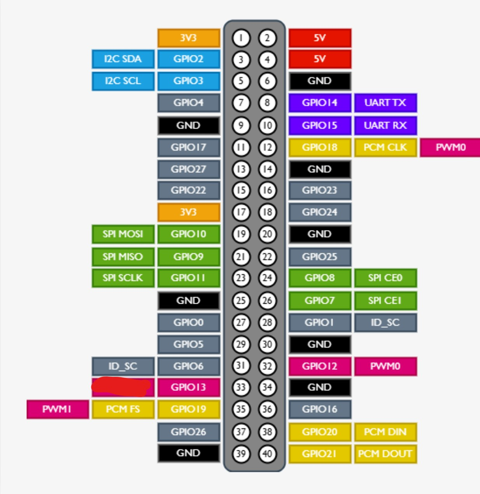

# Rover Cockpit & Telemetry Dashboard

A high-performance control cockpit and telemetry dashboard for a custom 4WD / Mecanum Rover tank. The system is designed to run on a **Raspberry Pi 5** on board the rover, which communicates with a **Maker ESP32 Pro Board** (the low-level motor/encoder controller) and drives **4 wheel encoder motors**.

---

## 📐 Project Architecture & Two-Repository System

The rover operates on a **two-repository architecture**:

| Repository | Local Path | Deployment Target | Role & Purpose |
| :--- | :--- | :--- | :--- |
| **`yahboom-encoder`** *(This Repo)* | `C:\Users\Ron\electronic_projects\yahboom-encoder` | Raspberry Pi 5 (`/home/ron/yahboom-encoder`) | Host software: Cockpit API, LiDAR sidecar, ROS 2 Jazzy Docker stack, encoder odometry, TF transforms, Foxglove bridge, diagnostics, future SLAM/Nav2. |
| **`esp-maker-usba-4motor`** | `C:\Users\Ron\electronic_projects\esp\esp-maker-usba-4motor` | Maker USB32 Pro / Maker-ESP32 Pro Board | Embedded C++ PlatformIO firmware: motor control, encoder acquisition, closed-loop speed control, serial protocol, watchdog, arming, e-stop, and low-level safety. |

> [!IMPORTANT]
> **Legacy Repository Naming Clarification**:
> `yahboom-encoder` is a legacy repository and folder name. The rover **does not use the old Yahboom motor-driver board**. The active motor controller is the **Maker USB32 Pro / Maker-ESP32 Pro**. The repository name and RPi deployment path (`/home/ron/yahboom-encoder`) are intentionally left unchanged until the rover is fully operational.

### System Data Flow
```
Maker ESP32 firmware
 → USB serial (/dev/rover-esp32)
 → Raspberry Pi rover-server.service
 → read-only host APIs (http://127.0.0.1:3000)
 → ROS 2 Docker nodes
 → /odom, /scan, /tf and diagnostics
 → Foxglove now, SLAM/Nav2 later
```

### Hardware Ownership & Safety Boundaries
- **`rover-server.service`**: Exclusively owns `/dev/rover-esp32` (serial telemetry & commands).
- **`rover-lidar.service`**: Exclusively owns `/dev/rover-lidar` (LiDAR telemetry).
- **ROS 2 Docker Container**: Has **no `/dev` mounts** and reads read-only host APIs.
- **Foxglove**: Visualization only.
- **`/cmd_vel`**: Not currently enabled in ROS 2.
- **Arming Safety**: The rover must remain **disarmed** during software-only development and testing.

---

```
                                +-----------------------------+
                                |      Web Client Browser     |
                                |     (Control Cockpit UI)    |
                                +--------------+--------------+
                                               | (WebSockets / HTTP)
                                               v
+----------------------------------------------+----------------------------------------------+
| Raspberry Pi 5 On-Board Computer                                                            |
|                                                                                             |
|   +---------------------------------------------------------------------------------------+ |
|   |                                 Node.js Cockpit Server                                | |
|   |                                       (server.js)                                     | |
|   +-------------------------------------------+-------------------------------------------+ |
|                                               |                                             |
|                                               | (USB Serial /dev/ttyUSB0)                   |
|                                               v                                             |
+-----------------------------------------------+---------------------------------------------+
                                                |
                                                v
                                +---------------+---------------+
                                |     Maker ESP32 Pro Board     |
                                |  (Low-level Motor Controller) |
                                +---------------+---------------+
                                                |
                                                +---> 4x Encoder Motors
```

The system comprises two core parts:
1. **Low-level Brains (Maker ESP32 Pro Board)**: Directly interfaces with the 4 encoder motors (M1..M4), processing encoder ticks and driving motor power. It communicates with the host server over a fast binary protocol via USB serial. It also mocks gyro/accelerometer data based on motor control and sends simulated battery level.
2. **Host Server (Node.js)**: Runs on the RPi5. Serves the web interface, manages the serial connection to the ESP32 (`/dev/ttyUSB0`), processes joystick speed commands, and handles motor closed-loop position control.

---

## 🔩 Hardware References

Use this section to store authoritative hardware links (board repositories, schematics, pinout docs, and vendor resources).

* **Maker ESP32 Pro (physical driver/control board) repository:** https://github.com/nulllaborg/maker-esp32-pro.git
* **Raspberry Pi 5 GPIO Pinout:**
  

---

## 🛠️ Deploying to the Raspberry Pi 5

We have automated the deployment pipeline using RPi5-specific systemd service configurations and automated scripts.

### 1. Configure Local Environment
Create or edit your local `.env` file (which is git-ignored) in the root of the project to define the target network credentials and serial port:
```env
# WiFi Credentials (used by setup scripts)
WIFI_SSID=<your_wifi_ssid>
WIFI_PASSWORD=<your_wifi_password>

# RPi5 Deployment & Target Configurations
RPI_IP=<your_rpi5_ip_address>
RPI_USER=ron
RPI_PASSWORD=<your_rpi5_password>

# Server Settings
PORT=3000
SERIAL_PORT=/dev/ttyUSB0
BAUD_RATE=115200
```

### 2. Deploy from Windows to RPi5
Open a PowerShell terminal in the project directory on your Windows dev machine and execute:
```powershell
.\rpi5\deploy.ps1
```
*This script will pack the project files (excluding dependencies/cache), transfer them to the Pi (using details specified in your `.env` file), and execute the remote installation script.*

### 3. Remote Setup Details
The script automatically executes `rpi5/setup.sh` on the RPi5, which:
* Installs system prerequisites (`nodejs`, `build-essential`).
* Configures local NetworkManager to connect to the configured WiFi (defined in `.env` as `WIFI_SSID`).
* Installs all Node dependency modules.
* Installs and launches the persistent systemd background service:
  * **`rover-server.service`**: Automatically starts the Node server on boot.

---

## 🩺 Monitoring and Maintenance

Once deployed, the Cockpit webpage is served at:
**`http://<your_rpi5_ip_address>:3000`**

To monitor the background services on the Pi, SSH into `<your_rpi5_ip_address>` and run:

```bash
# Check service status
systemctl status rover-server.service

# View real-time output logs
journalctl -u rover-server.service -f
```

---

## 📂 Project Structure

* `server.js` - Primary Express & WebSocket telemetry + control server.
* `rplidar_sidecar.py` - Python async service for RPLIDAR C1.
* `public/` - Dashboard web frontend (HTML/CSS/JS).
* `maker_esp32_pro/` - Firmware project directory for the ESP32 microcontroller.
* `rpi5/` - Deployment artifacts:
  * `deploy.ps1` - Windows packaging & SSH/SFTP deployment automation.
  * `setup.sh` - System configuration, dependencies, and service installation.
  * `99-rover-lidar.rules` - udev rule mapping CP2102N to `/dev/rover-lidar`.
  * `rover-server.service.template` - Service unit configuration template.
  * `rover-lidar.service.template` - LiDAR service unit configuration template.

---

## 📡 RPLIDAR C1 Integration

The rover integrates a USB RPLIDAR C1 scanning telemetry sensor connected directly to the Raspberry Pi 5.

### 1. Hardware Connection & Symlink
* The RPLIDAR C1 CP2102N USB converter registers dynamically on the Pi.
* A custom udev rule `/etc/udev/rules.d/99-rover-lidar.rules` creates a stable `/dev/rover-lidar` symlink with `0666` permissions on boot.

### 2. Python Async Sidecar Service (`rover-lidar.service`)
* The `rplidar_sidecar.py` service runs on port `3002`.
* It utilizes the `rplidarc1` asynchronous library to connect to `/dev/rover-lidar` at `460800` baud.
* It downsamples scan data to a maximum of 360 points (1-degree increments) and exposes them on:
  - `GET /status`: telemetry performance, scan Hz, health, errors.
  - `GET /scan`: latest complete 360-degree polar coordinate measurements.
* The Node Express server proxies these routes under `/api/lidar/status` and `/api/lidar/scan`.

### 3. Monitoring LiDAR
To monitor the LiDAR background service on the Pi, run:
```bash
# Check service status
systemctl status rover-lidar.service

# View real-time output logs
journalctl -u rover-lidar.service -f
```

### 4. Physical Dimensions & SLAM Configuration
To configure SLAM (e.g., Cartographer, Gmapping, or RTAB-Map) and the robot TF tree, use the following physical dimensions and sensor mounting offsets:

* **Rover Physical Dimensions:**
  - **Length ($L$):** $9.0\text{ inches}$ ($228.6\text{ mm}$ or $0.2286\text{ m}$)
  - **Width ($W$):** $8.75\text{ inches}$ ($222.25\text{ mm}$ or $0.22225\text{ m}$)

* **LiDAR Mounting Position:**
  - **Front Offset:** Mounted $4.0\text{ inches}$ ($101.6\text{ mm}$ or $0.1016\text{ m}$) behind the front-most edge of the rover.
  - **Left Offset:** Mounted $3.0\text{ inches}$ ($76.2\text{ mm}$ or $0.0762\text{ m}$) inside from the left-most edge of the rover.

* **SLAM TF Transform (`base_link` to `laser` / `laser_frame`):**
  If defining `base_link` as the physical center of the rover body ($X$ pointing forward, $Y$ pointing left, $Z$ pointing up):
  - **$x$ translation (forward):** $+0.5\text{ inches} = +12.7\text{ mm} = +0.0127\text{ m}$ (calculated as $L/2 - \text{Front Offset} = 4.5" - 4"$)
  - **$y$ translation (left):** $+1.375\text{ inches} = +34.925\text{ mm} = +0.034925\text{ m}$ (calculated as $W/2 - \text{Left Offset} = 4.375" - 3"$)
  - **$z$ translation (height):** Adjust based on vertical mount height.
  - **Yaw rotation:** $0.0\text{ rad}$ (LiDAR is aligned facing forward).

