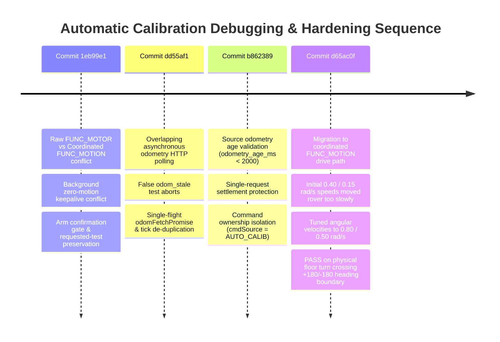

# Motion Control, Architecture & Automatic Calibration

## 1. Executive Summary

This document details the intended motion control pipeline, component responsibilities, system layer distinctions, complete failure-and-fix chronology during automatic floor calibration commissioning, physical floor test results, and proposed future automated commissioning system for the Yahboom RPi5 / ESP32 Rover.

---

## 2. Intended Motion Control Pipeline & Architecture

### Intended Command Path
```
Nav2 controller
  → velocity smoothing and safety
  → command ownership/arbitration
  → RPi/ESP32 coordinated motion controller
  → motors and encoders
  → odometry returned to ROS 2
```

```mermaid
graph TD
    A["Nav2 Controller Plugin (DWB)"] -->|Twist /cmd_vel_raw| B["nav2_velocity_smoother"]
    B -->|Smoothed Twist /cmd_vel| C["Command Ownership & Safety Layer (Cockpit server.js)"]
    C -->|Coordinated FUNC_MOTION Packet [vx, vy, vz]| D["RPi5 / ESP32 Coordinated Motion Controller"]
    D -->|PWM & Direction Flags| E["Motors & Encoders (M1..M4)"]
    E -->|Raw Encoder Telemetry| F["Encoder Odometry Node (rover_encoder_odometry)"]
    F -->|Odometry /odom & TF odom->base_link| A
```

### Component Responsibilities & System Layer Distinctions

1. **ROS 2 Infrastructure**:
   - Provides process lifecycle, node architecture, topic pub/sub communication (`/cmd_vel`, `/odom`, `/tf`), and global parameters (`rclpy` / `rclcpp`).
2. **Nav2 Navigation Stack**:
   - Generates desired body velocity ($v_x, v_y, \omega_z$) during normal autonomous navigation based on global trajectories (`planner_server`) and local obstacle avoidance (`controller_server` with DWB plugin).
3. **Velocity Smoother (`nav2_velocity_smoother`)**:
   - Applies acceleration, deceleration, jerk, linear/angular speed, and deadband limits to raw controller output before passing commands to low-level bridges.
4. **Command Ownership and Safety Layer (`server.js`)**:
   - Enforces strict command arbitration (`cmdSource`: `'AUTONOMY'`, `'AUTO_CALIB'`, `'JOYSTICK'`, `'DIRECT'`).
   - Validates authorization tokens (`X-Rover-Bridge-Token`), handles E-Stop, monitors watchdog timeouts, enforces arming gates, and formats binary serial frames.
5. **Base Controller & Hardware Driver (RPi5 / ESP32)**:
   - Responsible for making valid linear and angular velocity commands physically achievable within vehicle dynamic limits.
   - Transforms high-level chassis velocities ($v_x, \omega_z$) into per-wheel motion targets.
6. **ESP32 Microcontroller & Encoder-Control Layer**:
   - Responsible for dependable wheel motion, closed-loop PID speed regulation, encoder pulse counting, watchdog disarm protection, and hardware safety.
7. **Automatic Calibration Tool (`AUTO_CALIB`)**:
   - A specialized **commissioning tool**, *not* the normal Nav2 controller.
   - Operates in isolation under dedicated ownership (`cmdSource = 'AUTO_CALIB'`) to measure track width, wheel scale, and turn accuracy under controlled test conditions.
8. **Calibration Taper Speed vs Physical Stall**:
   - A validated calibration taper speed (e.g. 0.50 rad/s) is a conservative commissioning decelerating minimum, not necessarily the exact physical motor stall threshold.

---

## 3. Floor Calibration Failure & Repair Sequence

During automatic calibration floor testing on the deployed rover, a detailed failure and repair sequence was documented and systematically resolved across four key commits:



### Complete 14-Step Failure and Repair Sequence

1. **Automatic arm succeeded, but the rover did not move.**
2. **Raw per-wheel `FUNC_MOTOR` commands conflicted with the normal coordinated-motion path.**
3. **The background drive loop continued transmitting zero `FUNC_MOTION` commands**, immediately overwriting motor targets.
4. **Command ownership and an explicit `AUTO_CALIB` source were required** to isolate calibration driving from other command sources.
5. **The requested test identifier needed to remain available in the result** object for status reporting upon completion or abort.
6. **Overlapping asynchronous odometry requests caused false `odom_stale` failures** due to socket congestion and out-of-order responses.
7. **A single in-flight odometry request (`odomFetchPromise`) was added** to deduplicate concurrent polling.
8. **Last-good odometry timestamps (`lastOdomSuccessTime`) were tracked** to maintain a reliable freshness window.
9. **The source-provided odometry age (`odometry_age_ms < 2000`) was validated** before accepting coordinates as active ground truth.
10. **The HTTP request was protected against multiple completion paths** using single-settlement flags.
11. **Calibration movement was migrated to the already proven coordinated `FUNC_MOTION` path**, unifying serial transport.
12. **Safe zero-motion, ownership cleanup, and disarm were maintained** on test conclusion or emergency stop.
13. **Initial turn settings of 0.40 and 0.15 rad/s moved the rover too slowly**, suffering from floor static friction stall and translation drift.
14. **Values of 0.80 and 0.50 rad/s produced the successful physical result.**

---

## 4. Confirmed Physical Floor Result

The physical rover at commit `d65ac0f` with `0.80` / `0.50` rad/s tuned defaults successfully completed an automatic floor turn test across the $+180^\circ / -180^\circ$ heading boundary:

- **Test Name**: `turn_left_90`
- **Result**: `PASS`
- **Starting Pose**: Approximately $(x = 0.003\,\text{m}, y = 0.031\,\text{m}, \theta = 91.3^\circ)$
- **Ending Pose**: Approximately $(x = -0.019\,\text{m}, y = 0.032\,\text{m}, \theta = -178.3^\circ)$
- **Translation**: $0.0222\,\text{m}$ (well within $0.20\,\text{m}$ safety threshold)
- **Measured Yaw**: $90.47^\circ$
- **Yaw Error**: $+0.47^\circ$
- **Duration**: $4.3\,\text{seconds}$
- **Stop Reason**: `target_reached`
- **Automatic Disarm**: Succeeded immediately upon test completion
- **Boundary Traversal**: The heading correctly crossed the $+180^\circ / -180^\circ$ degree boundary during the turn.
- **Visual Accuracy**: The user visually judged the physical 90-degree turn to be accurate.

---

## 5. Validated Runtime Motion Parameters

```javascript
AUTO_CALIB_TURN_RADPS = 0.80      // Standard automatic calibration turn speed (rad/s)
AUTO_CALIB_MIN_TURN_RADPS = 0.50  // Minimum tapered turn speed before target arrival (rad/s)
```

### Invariant Calibration Geometry Constants (Unchanged)
- **`TICKS_PER_REV`**: `1974.1666666667`
- **Effective Skid-Steer Track Width**: `0.3408575433` m
- **Physical Measured Track Width**: `0.197` m

---

## 6. Proposed Future Automated Commissioning Sequence

To expand calibration beyond spot testing into a fully automated commissioning pipeline, the following multi-stage characterization suite is proposed for future implementation:

1. **Measured-Distance Wheel Scale Calibration**:
   - Execute forward and reverse $1.000\,\text{m}$ moves at controlled speeds over a verified physical tape measure.
   - Compute wheel diameter scale factor correction ratios across multiple runs.
2. **Independent-Heading Effective Track Width Calibration**:
   - Execute $\pm 360^\circ$ and $\pm 720^\circ$ continuous rotations.
   - Compute effective kinematic track width ($B_{\text{eff}}$) by comparing integrated encoder yaw against absolute IMU / LiDAR scan matcher ground truth.
3. **Minimum Sustainable Forward/Reverse Velocity Sweep**:
   - Increment linear velocity from $0.01\,\text{m/s}$ upward in $0.01\,\text{m/s}$ steps to identify physical breakaway and minimum sustainable linear velocity ($v_{\text{min}}$).
4. **Minimum Sustainable Left/Right Angular Velocity Sweep**:
   - Increment angular velocity from $0.05\,\text{rad/s}$ upward in $0.05\,\text{rad/s}$ steps to identify physical rotational stall and minimum sustainable angular velocity ($\omega_{\text{min}}$).
5. **Acceleration / Deceleration Characterization**:
   - Step velocity commands and measure encoder ramp response times to establish physical maximum linear ($a_{x,\text{max}}$) and angular ($\alpha_{z,\text{max}}$) acceleration limits.
6. **Multi-Run Median Filtering & Environmental Context**:
   - Perform minimum $N=5$ trials per test.
   - Filter outliers using median metrics while logging battery voltage ($V_{\text{bat}}$) and surface material type with every dataset.
7. **Version-Controlled Motion Profile Output**:
   - Automatically output a validated `motion_profile.json` artifact for human review prior to committing to version control.
