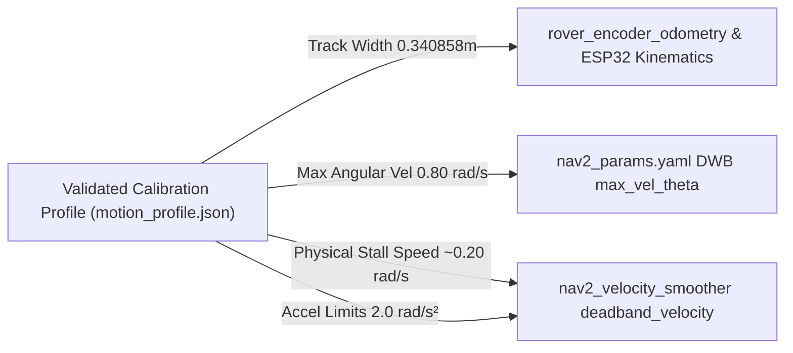

# Nav2 Motion Tuning Audit & Configuration Analysis

## 1. Overview

This document presents a comprehensive audit of the active ROS 2 and Nav2 motion configuration files in `yahboom-encoder`. It identifies existing parameters, missing safety/smoothing layers, and provides concrete guidance on how validated physical motion parameters should be integrated into Nav2 without causing navigation instability.

---

## 2. Current Nav2 & ROS 2 Parameter Audit Matrix

| Parameter / Layer | Status | Source File & Location | Current Configured Value |
| :--- | :--- | :--- | :--- |
| **Nav2 Controller Plugin** | Present | [nav2_params.yaml](file:///C:/Users/Ron/electronic_projects/yahboom-encoder/ros2/ros2_ws/src/rover_bringup/config/nav2_params.yaml#L128-L129) | `dwb_core::DWBLocalPlanner` (plugin under `FollowPath`) |
| **Controller Frequency** | Present | [nav2_params.yaml](file:///C:/Users/Ron/electronic_projects/yahboom-encoder/ros2/ros2_ws/src/rover_bringup/config/nav2_params.yaml#L108) | `10.0` Hz (`controller_frequency`) |
| **`cmd_vel` Topic & Remapping** | Present | [rover_cmd_vel_bridge.py](file:///C:/Users/Ron/electronic_projects/yahboom-encoder/ros2/ros2_ws/src/rover_bringup/rover_bringup/rover_cmd_vel_bridge.py#L47-L52) | Subscribes to `/cmd_vel` (no remapping in launch files); posts to internal Cockpit API (`http://127.0.0.1:3010/api/cmd_vel`) |
| **Velocity Smoother** | **ABSENT** | [navigation.launch.py](file:///C:/Users/Ron/electronic_projects/yahboom-encoder/ros2/ros2_ws/src/rover_bringup/launch/navigation.launch.py) & [nav2_params.yaml](file:///C:/Users/Ron/electronic_projects/yahboom-encoder/ros2/ros2_ws/src/rover_bringup/config/nav2_params.yaml) | Not configured or launched (`nav2_velocity_smoother` node missing) |
| **Max / Min Linear Velocity ($v_x$)** | Present | [nav2_params.yaml](file:///C:/Users/Ron/electronic_projects/yahboom-encoder/ros2/ros2_ws/src/rover_bringup/config/nav2_params.yaml#L131-L137) | `max_vel_x: 0.3` m/s, `min_vel_x: -0.2` m/s, `min_speed_xy: 0.0` m/s, `max_speed_xy: 0.3` m/s |
| **Max / Min Angular Velocity ($\omega_z$)** | Present | [nav2_params.yaml](file:///C:/Users/Ron/electronic_projects/yahboom-encoder/ros2/ros2_ws/src/rover_bringup/config/nav2_params.yaml#L135-L138) | `max_vel_theta: 1.0` rad/s, `min_speed_theta: 0.1` rad/s |
| **Linear Acceleration / Deceleration** | Present | [nav2_params.yaml](file:///C:/Users/Ron/electronic_projects/yahboom-encoder/ros2/ros2_ws/src/rover_bringup/config/nav2_params.yaml#L139-L142) | `acc_lim_x: 1.0` m/s², `decel_lim_x: -1.0` m/s² |
| **Angular Acceleration / Deceleration** | Present | [nav2_params.yaml](file:///C:/Users/Ron/electronic_projects/yahboom-encoder/ros2/ros2_ws/src/rover_bringup/config/nav2_params.yaml#L141-L144) | `acc_lim_theta: 2.0` rad/s², `decel_lim_theta: -2.0` rad/s² |
| **`deadband_velocity`** | **ABSENT** | [nav2_params.yaml](file:///C:/Users/Ron/electronic_projects/yahboom-encoder/ros2/ros2_ws/src/rover_bringup/config/nav2_params.yaml) | Not configured in DWB or velocity smoother; threshold defaults `min_x_velocity_threshold: 0.001`, `min_theta_velocity_threshold: 0.001` |
| **Progress Checker** | Present | [nav2_params.yaml](file:///C:/Users/Ron/electronic_projects/yahboom-encoder/ros2/ros2_ws/src/rover_bringup/config/nav2_params.yaml#L117-L120) | `nav2_controller::SimpleProgressChecker` (`required_movement_radius: 0.2` m, `movement_time_allowance: 10.0` s) |
| **Goal Checker & Yaw Tolerance** | Present | [nav2_params.yaml](file:///C:/Users/Ron/electronic_projects/yahboom-encoder/ros2/ros2_ws/src/rover_bringup/config/nav2_params.yaml#L122-L126) | `nav2_controller::SimpleGoalChecker` (`xy_goal_tolerance: 0.15` m, `yaw_goal_tolerance: 0.25` rad / ~14.3°) |
| **`cmd_vel` Bridge Safety Limits** | Present | [rover_cmd_vel_bridge.py](file:///C:/Users/Ron/electronic_projects/yahboom-encoder/ros2/ros2_ws/src/rover_bringup/rover_bringup/rover_cmd_vel_bridge.py#L78-L96) & `server.js` | Bridge rejects NaN/Inf and unsupported non-planar axes ($v_y, v_z, \omega_x, \omega_y$); Cockpit enforces speed clamps (`0.50` m/s, `1.50` rad/s) |
| **Command Ownership / Arbitration** | Present | [server.js](file:///C:/Users/Ron/electronic_projects/yahboom-encoder/server.js#L2919) | Cockpit `cmdSource` arbitration (`AUTONOMY`, `AUTO_CALIB`, `JOYSTICK`, `DIRECT`); token headers and mode state required |
| **Odometry Source & Rate** | Present | [rover_encoder_odometry.py](file:///C:/Users/Ron/electronic_projects/yahboom-encoder/ros2/ros2_ws/src/rover_bringup/rover_bringup/rover_encoder_odometry.py#L115) | HTTP polling of `/api/encoders` at `20.0` Hz; publishes `/odom` and TF `odom -> base_link`; HTTP status sidecar on port `3003` |

---

## 3. Analysis: What Currently Exists vs What Is Missing

### Currently Existing
1. **Kinematic Constants**: Standardized across Python, Node, and YAML (`ticks_per_revolution = 1974.1666666667`, `track_width_m = 0.3408575433`, `physical_track_width_m = 0.197`).
2. **DWB Trajectory Generator**: Configured for differential/skid-steer drive (`vy_samples: 1`, `min_vel_y: 0.0`, `max_vel_y: 0.0`).
3. **Bridge Verification**: `rover_cmd_vel_bridge.py` validates numeric sanity and authenticates via `X-Rover-Bridge-Token`.

### Missing Architecture Components
1. **`nav2_velocity_smoother` Node**: Currently missing from the launch stack. Without velocity smoothing, raw DWB velocity steps are passed directly to the bridge, causing wheel slip and skid-steer floor chatter during direction reversals.
2. **Dynamic Velocity Profiling**: Navigation parameters rely on fixed conservative bounds rather than dynamically loading calibrated floor profiles.

---

## 4. Critical Guidance: Calibration Taper Speed vs Hardware Deadband

> [!CAUTION]
> **DO NOT automatically set Nav2 `deadband_velocity` or DWB `min_speed_theta` to `0.50` rad/s merely because `AUTO_CALIB_MIN_TURN_RADPS` is set to `0.50`.**

### Rationale & Differentiation

1. **Role of `AUTO_CALIB_MIN_TURN_RADPS = 0.50` rad/s**:
   - `0.50` rad/s is a **validated reliable calibration deceleration floor**. During single-test commissioning (e.g., 90° turn), tapering down to `0.50` rad/s prevents overshooting the target angle while maintaining sufficient torque to overcome floor resistance without stalling.
   - It is **not** a measured physical hardware stall limit ($V_{\text{stall}}$).

2. **Risks of Setting Nav2 Deadband to `0.50` rad/s**:
   - In Nav2, setting `deadband_velocity = 0.50` rad/s would cause the controller to clamp any requested angular speed below $0.50\,\text{rad/s}$ down to $0.0\,\text{rad/s}$.
   - This prevents fine heading adjustments during path alignment, leading to goal-approach oscillation, goal-checker failures, and inability to settle within `yaw_goal_tolerance: 0.25` rad (~14.3°).

3. **Recommendation for Deadband Configuration**:
   - Conduct a dedicated **minimum sustainable angular velocity sweep** (from $0.05\,\text{rad/s}$ upward in fine steps) on representative floor surfaces.
   - Set Nav2 controller `min_speed_theta` and velocity smoother deadband only to the true physical stall threshold ($1.1 \times \omega_{\text{stall}}$), which is expected to be substantially lower than $0.50\,\text{rad/s}$ (likely around $0.15 - 0.25\,\text{rad/s}$).

---

## 5. Consumption of Calibrated Motion Profiles in Nav2

When future commissioning generates a validated motion profile (`motion_profile.json`), the parameters should be consumed as follows:

1. **`track_width_m` ($0.3408575433\,\text{m}$)**:
   - Consumed by `rover_encoder_odometry.py` and ESP32 parameters to ensure exact wheel-tick-to-yaw integration.
2. **Max Calibrated Angular Speed ($0.80\,\text{rad/s}$)**:
   - Consumed by DWB `max_vel_theta` and `nav2_velocity_smoother` limits.
3. **Hardware Stall Threshold (Pending Sweep)**:
   - Consumed by `nav2_velocity_smoother` `deadband_velocity` to zero out sub-stall commands that produce heat without physical movement.
